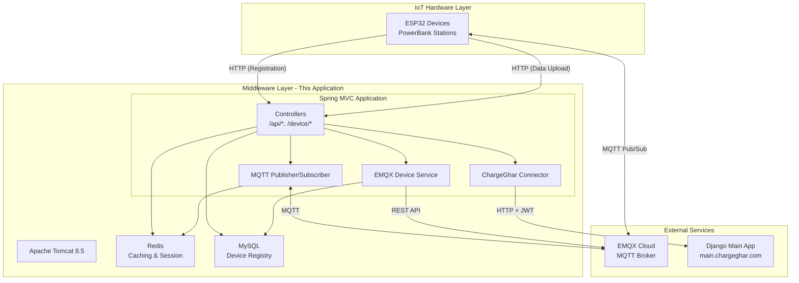
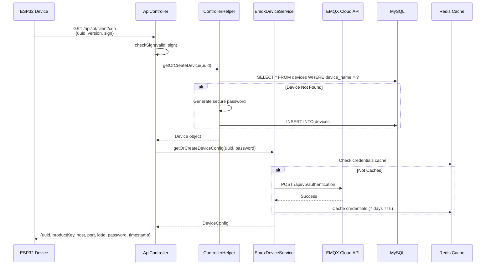
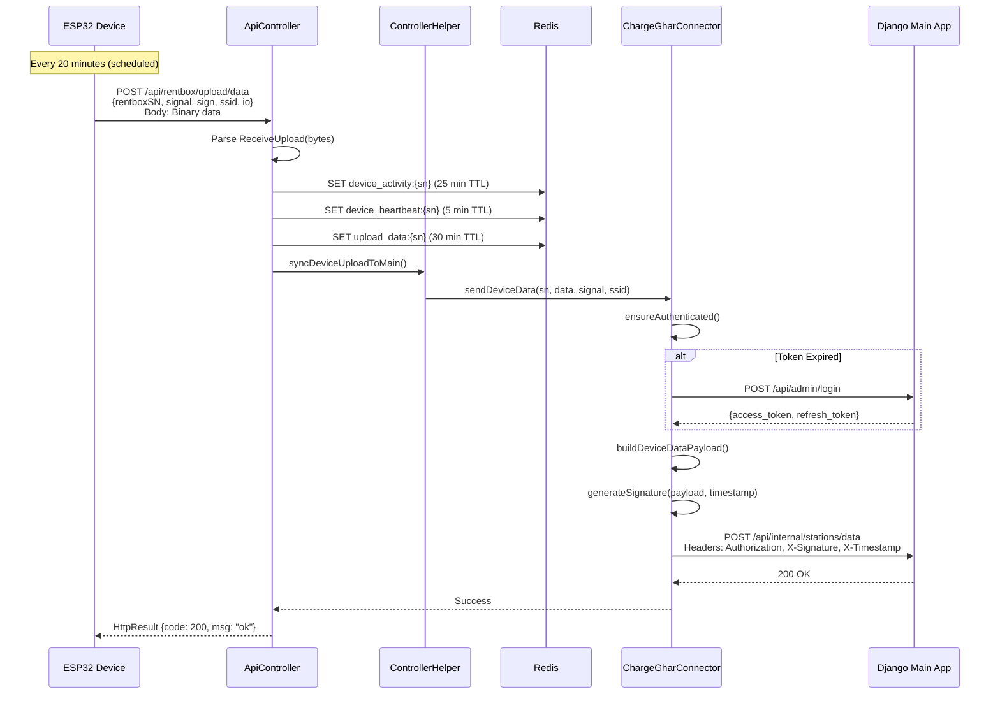
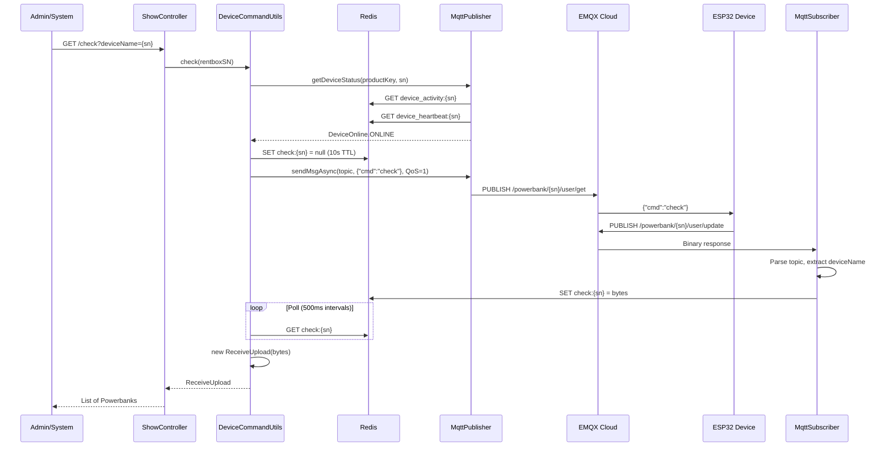
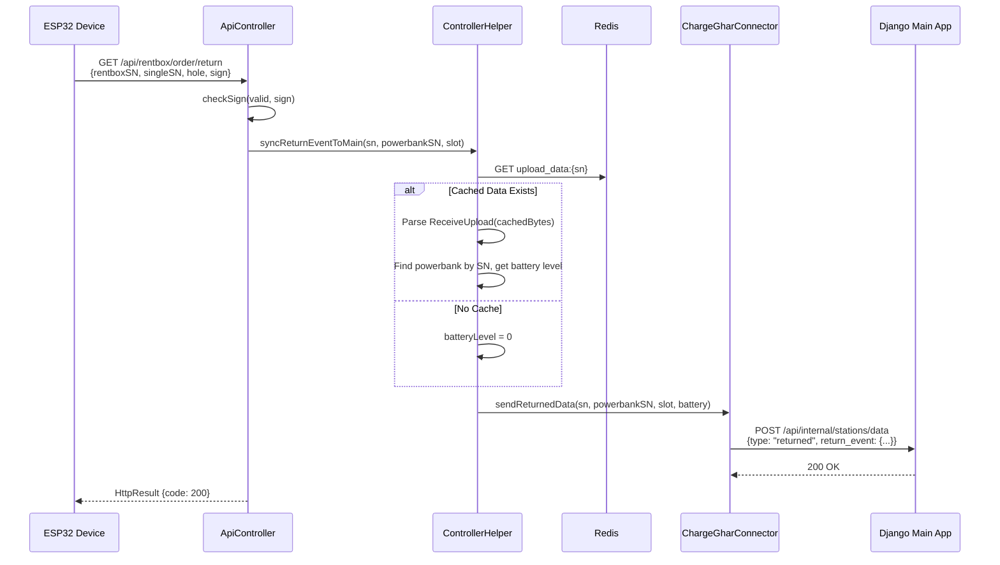
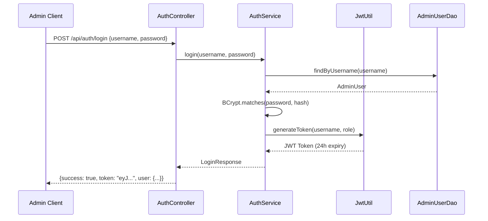

# ChargeGhar Devices - IoT Middleware Platform

**Analysis Date:** December 25, 2025  
**Analyzed by:** Senior Java/IoT Architect (10+ years experience)

---

## 📋 Executive Summary

**ChargeGhar Devices** is a **Java 8 Spring MVC IoT middleware application** that serves as the core communication layer between IoT hardware devices (powerbank rental stations) and a Django-based main application. The system uses **MQTT over EMQX Cloud** for real-time device communication and **HTTP REST APIs** for device registration and data synchronization.

---

## 📑 Table of Contents

- [Architecture Overview](#-architecture-overview)
- [Technology Stack](#-technology-stack)
- [Package Structure](#-package-structure-analysis)
- [Data Flow Analysis](#-data-flow-analysis)
- [MQTT Topic Architecture](#-mqtt-topic-architecture)
- [Binary Protocol Analysis](#-binary-protocol-analysis)
- [Security Architecture](#-security-architecture)
- [Data Storage Architecture](#-data-storage-architecture)
- [Controller Endpoints](#-controller-endpoints)
- [Design Patterns](#-design-patterns-identified)
- [Configuration](#-configuration-files)
- [Quick Start](#-quick-start)
- [Related Documentation](#-related-documentation)

---

## 🏗️ Architecture Overview

### High-Level System Architecture



### Component Roles

| Component | Role |
|-----------|------|
| **ESP32 Devices** | Physical powerbank stations, communicate via HTTP + MQTT |
| **This Application** | IoT middleware, protocol translation, device management |
| **EMQX Cloud** | MQTT broker for real-time device communication |
| **Redis** | Caching, session management, command response queuing |
| **MySQL** | Device registry and admin user storage |
| **Django Main** | Business logic, user management, rental processing |

---

## 🛠️ Technology Stack

| Layer | Technology | Version | Purpose |
|-------|------------|---------|---------|
| **Runtime** | Java | 8 | Core language |
| **Framework** | Spring MVC | 4.3.30 | Web framework |
| **Build** | Maven | 3.x | Dependency management |
| **Server** | Tomcat | 8.5 | Application server |
| **Template** | FreeMarker | 2.3.31 | View rendering |
| **MQTT** | Eclipse Paho | 1.2.5 | MQTT client |
| **Caching** | Redis (Jedis) | 2.9.0 | Session, data caching |
| **Database** | MySQL | 8.0 | Device registry |
| **JSON** | Jackson | 2.15.2 | Serialization |
| **Security** | JJWT | 0.11.5 | JWT authentication |
| **HTTP** | Apache HttpClient | 4.5.14 | External API calls |
| **Container** | Docker | - | Deployment |

---

## 📦 Package Structure Analysis

```
src/main/java/com.demo/
├── bean/              # Validation beans & DTOs
├── common/            # Shared utilities & configurations
├── connector/         # External system connectors (Django)
├── controller/        # REST API controllers
├── dao/               # Data access objects (JDBC)
├── emqx/              # EMQX Cloud integration
├── helper/            # Controller helper utilities
├── message/           # Binary protocol messages
├── model/             # Domain models
├── mqtt/              # MQTT pub/sub handlers
├── security/          # Authentication & JWT
├── serialport/        # Serial port data utilities
├── service/           # Business logic services
└── tools/             # Utility classes
```

### Package Details

| Package | Files | Description | Key Classes |
|---------|-------|-------------|-------------|
| `controller` | 11 | REST endpoints | `ApiController`, `IndexController`, `AuthController` |
| `message` | 12 | Binary protocol parsing | `ReceiveUpload`, `Powerbank`, `Pinboard` |
| `mqtt` | 4 | MQTT communication | `MqttPublisher`, `MqttSubscriber`, `DeviceCommandUtils` |
| `emqx` | 4 | EMQX Cloud API | `EmqxApiClient`, `EmqxDeviceService` |
| `connector` | 1 | Django integration | `ChargeGharConnector` |
| `security` | 4 | Auth & JWT | `JwtUtil`, `AuthTokenManager` |
| `service` | 3 | Business logic | `AuthService`, `DeviceService` |
| `dao` | 2 | Data access | `AdminUserDao`, `DeviceDao` |

---

## 🔄 Data Flow Analysis

### 1. Device Registration Flow



### 2. Device Data Upload Flow (Primary Data Source)



### 3. MQTT Command Flow (Real-time Device Control)



### 4. Powerbank Return Event Flow



---

## 🔌 MQTT Topic Architecture

### Topic Naming Convention

```
/{productKey}/{deviceName}/user/{action}
```

Where:
- `productKey` = "powerbank" (configured)
- `deviceName` = Device serial number (e.g., "864601069946994")
- `action` = "get" | "update" | "heart"

### Topic Subscription Matrix

| Component | Subscribes To | Publishes To | Purpose |
|-----------|---------------|--------------|---------|
| **ESP32 Device** | `/powerbank/{sn}/user/get` | `/powerbank/{sn}/user/update`<br/>`/powerbank/{sn}/user/heart` | Receive commands, send responses |
| **MqttSubscriber** | `/powerbank/+/user/update`<br/>`/powerbank/+/user/heart` | - | Receive device responses & heartbeats |
| **MqttPublisher** | - | `/powerbank/{sn}/user/get` | Send commands to devices |

---

## 📊 Binary Protocol Analysis

### Message Structure

The system uses a proprietary binary protocol for device communication:

```
[Header: 4 bytes] [Data: Variable] [Checksum: 1 byte]
```

### Command Codes

| Code | Hex | Description | Request | Response Class |
|------|-----|-------------|---------|----------------|
| Check | 0x10 | Get device status | `{"cmd":"check"}` | `ReceiveUpload` |
| Check All | 0x10 | Get all slots | `{"cmd":"check_all"}` | `ReceiveUpload` |
| Popup | 0x31 | Eject powerbank | `{"cmd":"popup_sn","data":"SN"}` | `ReceivePopupSN` |
| Return | 0x40 | Powerbank returned | - | `ReceiveReturn` |

### Powerbank Data Model

```java
// 15 bytes per powerbank slot
public class Powerbank {
    int index;           // Slot number (1-20)
    int status;          // 0x00=empty, 0x01=normal, 0x02-0x06=error states
    int area;            // Area code
    int[] sn;            // 4-byte serial number
    int power;           // Battery level (0-100%)
    int temp;            // Temperature
    int voltage;         // Voltage (mV)
    int current;         // Current (mA)
    int softVersion;     // Firmware version
    int hardVersion;     // Hardware version
    String microSwitch;  // Micro switch state
    String solenoidValveSwitch; // Solenoid valve state
}
```

### Pinboard Data Model

```java
// 6 bytes per pinboard (controller board)
public class Pinboard {
    int index;       // Board index
    int io;          // IO status
    int temp;        // Temperature
    int softVersion; // Firmware version
    int hardVersion; // Hardware version
}
```

---

## 🔐 Security Architecture

### Authentication Layers

| Layer | Mechanism | Implementation |
|-------|-----------|----------------|
| **Device ↔ API** | HMAC Signature | `SignUtils.getSign()` |
| **Admin ↔ API** | JWT Bearer Token | `JwtUtil`, `AuthService` |
| **API ↔ EMQX** | Basic Auth | `EmqxApiClient` |
| **API ↔ Django** | JWT + Request Signature | `ChargeGharConnector`, `SignChargeGharMain` |

### Signature Verification Flow

```java
// Device request signature verification
@RequestMapping("/api/rentbox/upload/data")
public HttpResult rentboxOrderReturnEnd(..., @RequestParam String sign) {
    Map params = new HashMap<>();
    params.put("rentboxSN", rentboxSN);
    params.put("signal", signal);
    // Validate signature
    this.checkSign(params, sign, rentboxSN);
}

// SignUtils.getSign() computes HMAC-MD5 of sorted params
```

### JWT Token Flow (Admin Authentication)



---

## 🗄️ Data Storage Architecture

### MySQL Schema

```sql
-- Admin users table
CREATE TABLE admin_users (
    id INT AUTO_INCREMENT PRIMARY KEY,
    username VARCHAR(50) NOT NULL UNIQUE,
    password VARCHAR(255) NOT NULL,  -- BCrypt hashed
    email VARCHAR(100) UNIQUE,
    full_name VARCHAR(100),
    role ENUM('ADMIN', 'SUPER_ADMIN') DEFAULT 'ADMIN',
    is_active BOOLEAN DEFAULT TRUE,
    created_at TIMESTAMP DEFAULT CURRENT_TIMESTAMP,
    last_login TIMESTAMP NULL
);

-- Devices table
CREATE TABLE devices (
    id INT AUTO_INCREMENT PRIMARY KEY,
    device_name VARCHAR(100) NOT NULL UNIQUE,  -- Station serial number
    imei VARCHAR(50) UNIQUE,
    password VARCHAR(255) NOT NULL,  -- MQTT password
    created_at TIMESTAMP DEFAULT CURRENT_TIMESTAMP,
    created_by INT REFERENCES admin_users(id)
);
```

### Redis Key Patterns

| Pattern | TTL | Purpose | Data Type |
|---------|-----|---------|-----------|
| `device_activity:{sn}` | 25 min | Device online status | Long (timestamp) |
| `device_heartbeat:{sn}` | 5 min | Heartbeat status | Long (timestamp) |
| `upload_data:{sn}` | 30 min | Cached device data | byte[] |
| `check:{sn}` | 10 sec | Command response wait | byte[] |
| `popup_sn:{sn}` | 15 sec | Popup response wait | byte[] |
| `device_credentials:{sn}` | 7 days | EMQX credentials cache | DeviceCredentials |
| `clientConect:{sn}` | - | API cache | Mixed |

---

## 🎛️ Controller Endpoints

### ApiController (Device API)

| Method | Endpoint | Description |
|--------|----------|-------------|
| GET | `/api/iot/client/con` | Device registration & configuration |
| GET | `/api/iot/client/clear` | Clear device cache |
| POST | `/api/rentbox/upload/data` | Device data upload (binary) |
| GET | `/api/rentbox/order/return` | Powerbank return notification |
| GET | `/api/rentbox/config/data` | Get device configuration |

### ShowController (Admin Operations)

| Method | Endpoint | Description |
|--------|----------|-------------|
| GET | `/send` | Send raw MQTT command |
| GET | `/check` | Check device status |
| GET | `/check_all` | Check all slots |
| GET | `/popup` | Eject powerbank by SN |
| GET | `/popup_random` | Eject random powerbank |

### IndexController (Device Management)

| Method | Endpoint | Description |
|--------|----------|-------------|
| POST | `/device/create` | Register new device |
| POST | `/device/delete` | Delete device |
| GET | `/admin` | Admin panel |
| GET | `/admin/statistics` | Dashboard stats |

### AuthController (Authentication)

| Method | Endpoint | Description |
|--------|----------|-------------|
| POST | `/api/auth/login` | Admin login |
| POST | `/api/auth/logout` | Admin logout |
| GET | `/api/auth/me` | Get current user |

---

## 🔧 Design Patterns Identified

### 1. Service Layer Pattern
```
Controller → Service → DAO
```
- `AuthController` → `AuthService` → `AdminUserDao`
- Controllers handle HTTP, Services contain business logic, DAOs handle persistence.

### 2. Singleton Pattern
```java
// AuthTokenManager - Thread-safe singleton for token storage
public class AuthTokenManager {
    private static volatile AuthTokenManager instance;
    
    public static AuthTokenManager getInstance() {
        if (instance == null) {
            synchronized (AuthTokenManager.class) {
                if (instance == null) {
                    instance = new AuthTokenManager();
                }
            }
        }
        return instance;
    }
}
```

### 3. Factory Pattern
Binary protocol parsing uses factory-like construction:
```java
ReceiveUpload receiveUpload = new ReceiveUpload(bytes);
// Automatically parses bytes into Pinboard and Powerbank objects
```

### 4. Observer/Callback Pattern
```java
// MqttSubscriber implements MqttCallback
public class MqttSubscriber implements MqttCallback {
    @Override
    public void messageArrived(String topic, MqttMessage message) {
        // Process message asynchronously
    }
}
```

### 5. Retry Pattern with Exponential Backoff
```java
// ChargeGharConnector.sendWithRetry()
while (attempts < maxRetries) {
    attempts++;
    try {
        if (sendHttpPost(endpoint, jsonPayload)) return true;
    } catch (Exception e) {}
    
    int waitTime = (int) Math.pow(2, attempts) * 1000;  // 2s, 4s, 8s
    Thread.sleep(waitTime);
}
```

### 6. Cache-Aside Pattern
```java
// EmqxDeviceService - Check cache, fetch if miss, update cache
DeviceCredentials credentials = (DeviceCredentials) credentialsOps.get();
if (credentials == null) {
    credentials = createDeviceCredentials(deviceName, password);
    emqxApiClient.registerDevice(credentials.getUsername(), credentials.getPassword());
    credentialsOps.set(credentials, 7, TimeUnit.DAYS);
}
```

---

## 📁 Configuration Files

### config.properties
- MQTT broker settings (EMQX Cloud)
- Redis connection
- Django API integration credentials
- Signature secrets

### db-config.properties
- MySQL connection settings
- Connection pool configuration

### spring-code.xml
- Bean definitions (DAOs, Services, Security)
- DataSource configuration
- Property placeholder configuration

### spring-redis.xml
- Redis connection factory
- Redis template configuration
- Serialization settings

---

## 🚀 Quick Start

### Prerequisites

- Docker Desktop
- Git
- Java 8 (for local development)
- Maven 3.x (for local development)

### Run with Docker

```bash
# Clone repository
git clone <repository-url>
cd ChargeGhar_Devices

# Start all services
make run
# Or: docker-compose up -d

# View logs
make logs
```

### Local Development

```bash
# Build WAR file
mvn clean package

# Run tests
mvn test
```

### Access Points

| URL | Description |
|-----|-------------|
| http://localhost:8080/home/ | Main dashboard |
| http://localhost:8080/home/index.html | Device management |
| http://localhost:8080/home/listen.html | MQTT message viewer |
| http://localhost:8080/home/admin | Admin panel |

---

## 📈 Dependency Analysis

### Core Dependencies

```xml
<!-- Framework -->
<dependency groupId="org.springframework" artifactId="spring-webmvc" version="4.3.30.RELEASE"/>

<!-- IoT Communication -->
<dependency groupId="org.eclipse.paho" artifactId="org.eclipse.paho.client.mqttv3" version="1.2.5"/>

<!-- Caching -->
<dependency groupId="redis.clients" artifactId="jedis" version="2.9.0"/>
<dependency groupId="org.springframework.data" artifactId="spring-data-redis" version="1.8.16.RELEASE"/>

<!-- Security -->
<dependency groupId="io.jsonwebtoken" artifactId="jjwt-api" version="0.11.5"/>
<dependency groupId="org.springframework.security" artifactId="spring-security-crypto" version="5.7.11"/>

<!-- Database -->
<dependency groupId="mysql" artifactId="mysql-connector-java" version="8.0.33"/>
<dependency groupId="org.apache.commons" artifactId="commons-dbcp2" version="2.9.0"/>
```

---

## 📋 Summary

### Strengths
✅ Clean separation of concerns (Controller → Service → DAO)  
✅ Robust MQTT integration with EMQX Cloud  
✅ Proper binary protocol parsing for hardware communication  
✅ Caching strategy reduces database/API load  
✅ JWT-based authentication for admin APIs  
✅ Request signature verification for device APIs  
✅ Docker containerization for deployment  

### Areas for Improvement
⚠️ Outdated framework versions need upgrade  
⚠️ Security hardening needed (rate limiting, strict validation)  
⚠️ Monitoring and observability lacking  
⚠️ Error handling could be more consistent  
⚠️ Unit test coverage appears minimal  

### Architecture Score: 7/10
The application follows solid architectural patterns and handles the IoT communication requirements well. The main concerns are around the outdated technology stack and some security hardening opportunities.

> **See [IMPROVEMENTS.md](./IMPROVEMENTS.md) for detailed improvement roadmap with priority levels.**

---

## 📚 Related Documentation

| Document | Description |
|----------|-------------|
| [IMPROVEMENTS.md](./IMPROVEMENTS.md) | Technical debt and improvement roadmap |
| [docs/DEVICE_API_SERVICE_INTEGRATION.md](./docs/DEVICE_API_SERVICE_INTEGRATION.md) | Django integration guide |
| [docs/HARDWARE_COMMUNICATION_ANALYSIS.md](./docs/HARDWARE_COMMUNICATION_ANALYSIS.md) | Hardware protocol analysis |
| [endpoints.md](./endpoints.md) | Complete API reference |

---

## 📝 License

This project is licensed under the MIT License.

## 🤝 Contributing

1. Fork the repository
2. Create a feature branch (`git checkout -b feature/amazing-feature`)
3. Commit your changes (`git commit -m 'Add amazing feature'`)
4. Push to the branch (`git push origin feature/amazing-feature`)
5. Open a Pull Request

## 📞 Support

For issues and questions, please create an issue in the repository.